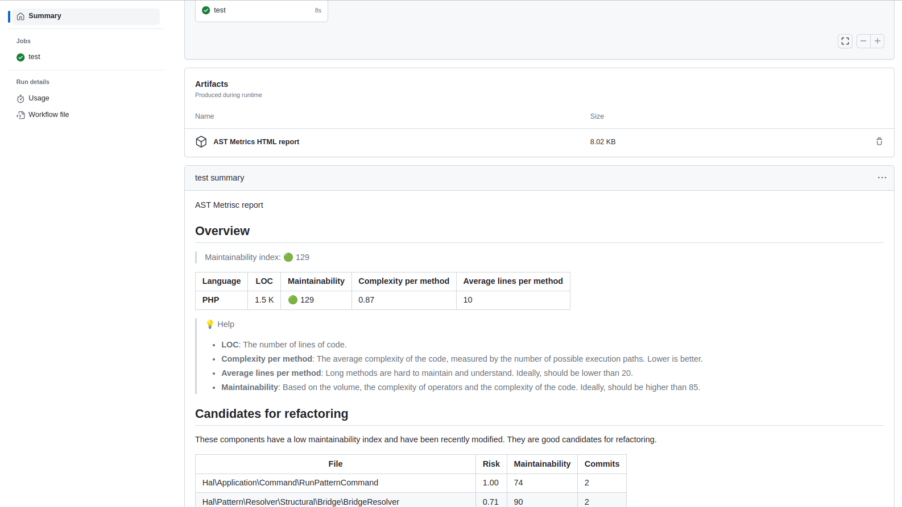

# ast-action

> Github action for [AST Metrics](https://github.com/Halleck45/ast-metrics/)

This will automatically add a markdown report to your build, containing metrics about your project (e.g. maintainability, complexity, etc.)

An artifact will also be created, containing the detailed HTML report.

## Example

On each build, you will get something like this:



You will find [live example here](https://github.com/Halleck45/DesignPatternDetector/actions/runs/8293499298) (if the build is still available).

## Usage

```yaml
- name: AST Metrics
  uses: halleck45/action-ast-metrics@v1.0.2
```

## Inputs

+ `version`: The version of AST Metrics to use. Default: `latest`
+ `directory`: The directory to analyze. Default: `.`

## License

MIT. See [LICENSE](LICENSE) for more details.